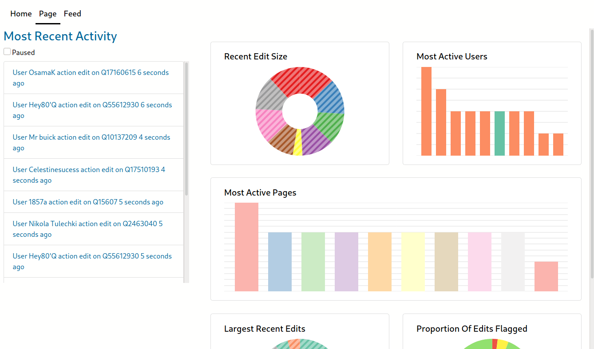

# Wikidata Live Changes



This is a website which visualises various changes to Wikidata in quasi-real-time. Wikidata is a collaboratively edited knowledge base hosted by the Wikimedia Foundation. The data visualised by our website will aid users of Wikidata to identify malicious edits to its databases.

## Getting Started

### Prerequisites

You will need to have installed:

1. Nodejs
2. NPM

## Running the website locally

1. Clone the GitHub repository

```
git clone https://github.com/isobelm/Software-Engineering.git
```

2. Navigate into the cloned GitHub repository

```
cd Software-Engineering
```

3. Install the dependencies

```
npm install
```

4. Run the server locally

```
npm start
```

The website should now have opened on your default browser. The server is hosted on [http://localhost:3000](http://localhost:3000)

## Built with

* JavaScript - Code language used
* [ReactJS](https://reactjs.org/) - Web framework used
* [React Bootstrap](https://react-bootstrap.github.io/) - CSS framework used
* [Nivo](https://nivo.rocks/) - Graphing framework used

## Authors
* [Isobel Mahon](https://github.com/isobelm)
* [Brian Lynch](https://github.com/brianlunch)
* [Odhran Mullan](https://github.com/omullan)
* [Lexes Jan Mantiquilla](https://github.com/lexesjan)
* [Alex Mahon](https://github.com/Juuiko)
* [Flora Molnar](https://github.com/flora-m)
